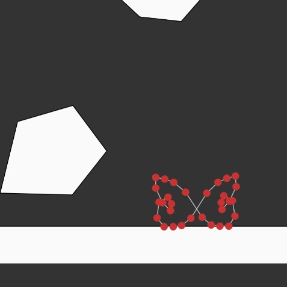

# Softbody Simulation
Simulating dynamics of a soft body using  a PBD solver. []
# Features
- Position based dynamics
- Spring mass model
- Continuous collision detection
- Mouse drag interactivity
# TODO
- self collisions
- sub stepping
- XPBD
- alpha shapes
# bugs
- collision is overpowered by spring constraints if soft body collides with high velocity
- for a grid structure, only the first collision takes a lot of time to solve.
- the softbody sometimes deforms and achieves a stable state different from the initial form. A collision with high velocity results in this deformation.
# Journey
## Spring mass model
THere are a lot of ways to simulate soft bodies. But the most beginner friendly method with the most resources is the spring mass model. The idea is to represent the softbody as a collection of masses attached by springs. At each time frame, we nudge the masses according to the spring forces acting on them. The spring constants determine how stiff the body is going to be.

## Rig and skinning
At first I represented the soft body as a grid. But it had the caveat of requiring the check for self collisions. So I switched to an approach I only kept the perimeter of the soft body and used a rig to represent the internal structure. \
 \
If we hide the internal springs, we get a soft body that looks like this: \
 \
This approach has the drawback of deforming the body and it achieving a stable state different from the initial form. This looks like a butterfly: \

Since this is rare, I will not modify it right now and focus on surface construction.

## Force accumulation in spring mass model
To nudge the masses, we apply force on them according to Hooke's law. The force affects accelration, which in turn affect the velocity and consequently the position of the masses. This method is simple but unstable. The spring constants, the gravity constants, and all other parameters have to be tuned just right. Otherwise, the simulation will not be stable and will explode in a very short amount of time.

## Position based Dynamics
This method is a substitute for the force accumulation method. We do not even look at any internal forces. Instead, we directly manipulate the position of the masses based on some factors. These factors include the external forces applied on the whole body (i.e. gravity, mouse drag, etc.) and internal constraints (spring constraints, collision constraints). This method is more stable and does not require parameter tuning.

## Collisions
The collisions are checked by drawing a ray from the current position of the mass $x$ to the predicted position $p$. If the ray intersects any polygon in the scene, then we report a continuous collision and generate a constraint for it. We only generate the constraint, we don't solve it right away for performance reasons. All the constraints are solved in the solve step. Where the predicted positions are modified to satisfy the constraints. 

### Mistakes while handling collisions
- Firstly I only checked if the predicted position $p$ is inside the polygon. If it is, then I reported a collision. This does not work because if the velocity is high, then both $x$ and $p$ might lie outside a polygon, but the ray $p-x$ intersects the polygon. So, I had to implement continuous collision.

- I reported a continuous collision as soon as the ray intersected any line of the polygon. But the reported collision and the colliding line should onlybe the closest line to the ray with the least distance. Same for polygons. A ray might intersect two overlapping olygons. Only return the one where the distance of collision is least.

- I thought there is no need for static collisions since, if we detect continuous collisions, the the case of the ray completely lying inside a polygon (and thereby being static collision) will not happen. If it does happen then that means the continuous collision failed. But it does happen since $x$ can be modified to be inside the polygon at any step of the algorithm. So, I had to implement static collisions.

## Challenges
- for a grid based structure, th simulation is more lifelike. But the simulation dropped in performance when the softbody hit the floor for the first time. The problem I identified was creating new `p5.Vector` objects every frame, which called the garbage collector extensively. Reusing the same object mitigated the problem somewhat with improved performance. Another reason was (which was most probably the defining factor) is that the fps drop only occured when I was drawing all the grid points and springs. The profiler showed that the `show()` method call was eating up a lot of time. So I changed the show ethod to surface and only draw the perimeter of the soft body.  

